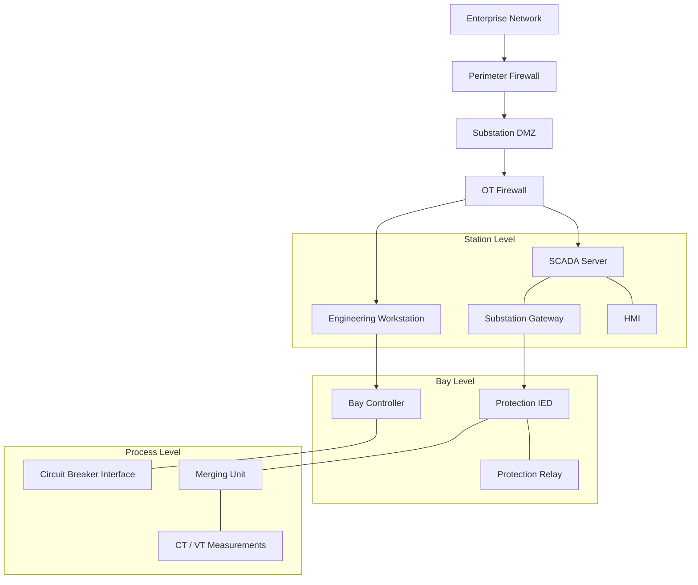

# Grid & Substation Cybersecurity

**Electrical Grid Security | IEC 61850 | DNP3 | SCADA | IED Protection | OT Network Segmentation**

## Project Overview

A cybersecurity engineering portfolio project focused on electrical substations and grid automation systems.

This project explores industrial communication protocols, network segmentation, threat modeling, cybersecurity risk assessment, and security validation planning.

The goal is to develop and demonstrate practical knowledge of security engineering principles applicable to electrical power infrastructure.

**Project status:** Architecture and security analysis documented. Hands-on substation simulation and technical validation are planned.

## Technical Focus

| Area | Technologies and Concepts |
|---|---|
| Grid Automation | SCADA, RTUs, protection relays, IEDs |
| Industrial Protocols | IEC 61850 MMS, GOOSE, Sampled Values, DNP3 |
| Network Security | Segmentation, firewalls, zones and conduits |
| Security Engineering | Threat modeling, risk assessment, security requirements |
| Security Monitoring | Wireshark, Suricata IDS (planned) |
| Security Standards | IEC 62443, IEC 62351, NIST SP 800-82 |

## Conceptual Substation Architecture

*Conceptual architecture illustrating functional relationships and proposed security boundaries. This is not a deployed or validated substation topology.*

## Security Engineering Work

### Network Architecture and Segmentation

- Documented station, bay, and process-level architecture.
- Defined proposed security zones and trust boundaries.
- Developed illustrative least-privilege firewall policies.
- Identified authorized communication requirements.

### IEC 61850 Security Analysis

- Examined MMS, GOOSE, and Sampled Values communication.
- Identified potential spoofing, replay, and unauthorized control threats.
- Documented security considerations associated with IEC 62351.
- Planned protocol traffic capture and analysis.

### DNP3 Security Analysis

- Studied SCADA master and remote outstation communication.
- Identified unauthorized control and data integrity risks.
- Reviewed DNP3 Secure Authentication concepts.
- Developed proposed network access controls.

### Threat Modeling and Risk Assessment

- Identified critical substation assets.
- Documented potential attack paths and trust boundaries.
- Developed a preliminary cybersecurity risk register.
- Proposed mitigations for high-priority threat scenarios.

### Security Validation Planning

- Developed structured test cases for industrial communication.
- Defined expected outcomes for network segmentation testing.
- Planned packet capture and security monitoring activities.
- Established an evidence collection methodology.

## Project Documentation

| Document | Description |
|---|---|
| [Substation Architecture](architecture/substation-topology.md) | Station, bay, and process-level architecture |
| [Network Segmentation](architecture/network-segmentation.md) | Proposed security zones and firewall rules |
| [IEC 61850 Security](protocols/iec61850-security.md) | MMS, GOOSE, and Sampled Values security |
| [DNP3 Security](protocols/dnp3-security.md) | DNP3 communication threats and controls |
| [Threat Model](security/threat-model.md) | Assets, attack paths, and mitigations |
| [Risk Assessment](security/risk-assessment.md) | Preliminary substation cybersecurity risk register |
| [Security Validation Plan](testing/security-validation.md) | Planned tests and evidence requirements |

## Planned Hands-On Lab

The next phase will involve an isolated substation simulation to:

1. Generate legitimate IEC 61850 or DNP3 traffic.
2. Capture and analyze industrial protocol packets.
3. Configure network segmentation controls.
4. Verify permitted and denied communication.
5. Investigate security monitoring events.
6. Publish reproducible test results and supporting evidence.

## Related Project

[OT Water Treatment Cybersecurity Lab](https://github.com/chathura1844/ot-water-treatment-security-lab)

An ongoing hands-on ICS security lab using OTForge, Docker, Suricata IDS, SCADA, and PLC components.

## Disclaimer

This is an independent educational cybersecurity project. It is not affiliated with GE Vernova or any utility operator.

Architecture diagrams, threat scenarios, and security controls are conceptual unless explicitly supported by documented laboratory evidence.
