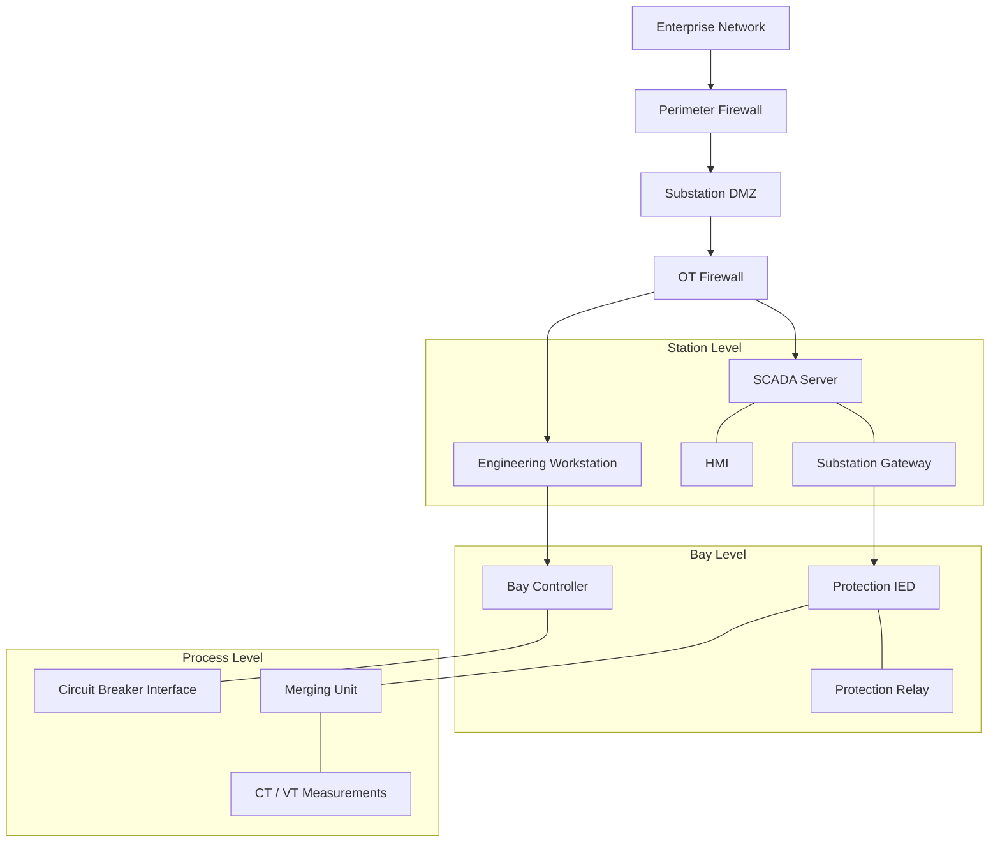

# Electrical Substation — Network Segmentation Design

## Objective

Design a conceptual segmented network for an electrical substation, applying defense-in-depth and IEC 62443 zone-and-conduit security principles.

This is a proposed architecture for cybersecurity study. Firewall enforcement and industrial protocol communication have not yet been tested.

## Conceptual Substation Security Architecture



**Diagram note:** The connections illustrate functional relationships and proposed security boundaries. They are not a validated physical wiring diagram or a complete representation of IEC 61850 communication paths.

## Security Zones

| Zone | Example Assets | Security Objective |
|---|---|---|
| Enterprise | Corporate workstations, IT services | Prevent direct unrestricted access to substation systems |
| Substation DMZ | Access gateways, approved intermediary services | Mediate and monitor IT/OT communications |
| Station Level | SCADA, HMI, engineering workstation, gateway | Protect supervisory control and engineering access |
| Bay Level | IEDs, protection relays, bay controllers | Restrict access to protection and control devices |
| Process Level | Merging units, measurement interfaces | Protect process data integrity and availability |

## Proposed Firewall Rules

| Source | Destination | Service | Intended Policy |
|---|---|---|---|
| Enterprise | Station Level | Direct access | DENY |
| Authorized DMZ Gateway | Approved Station Hosts | Required services only | ALLOW |
| SCADA | Authorized IEDs | IEC 61850 MMS, where applicable | ALLOW |
| Engineering Workstation | Approved IEDs | Authorized engineering services | ALLOW |
| Unapproved Hosts | Protection Devices | Unapproved access | DENY |

These are illustrative policy requirements. Actual port assignments and communication flows must be confirmed for the equipment and deployment.

## IEC 61850 Security Considerations

### MMS

IEC 61850 MMS supports supervisory communication between systems such as SCADA and IEDs.

Security considerations include restricting communication to authorized devices, controlling management access, and evaluating secure communication mechanisms.

### GOOSE

GOOSE supports time-sensitive event and protection messaging, typically using Layer 2 Ethernet multicast.

Security considerations include network isolation, appropriate switching design, message integrity, and protection of timing requirements.

### Sampled Values

Sampled Values transport measurement data, commonly within process bus architectures.

Security design must consider bandwidth, availability, synchronization, and operational performance.

## Proposed Security Monitoring

- Monitor unexpected engineering workstation access to IEDs.
- Identify unauthorized communication across security zones.
- Review device configuration changes.
- Collect security-relevant logs where supported.
- Baseline normal supervisory and protection communications.

## Planned Validation

1. Create a simulated substation topology.
2. Identify approved communication flows.
3. Configure segmentation policies.
4. Test authorized station-to-bay communications.
5. Verify blocked unauthorized connections.
6. Capture relevant traffic and security logs.
7. Record observed results.

## Project Status

**Completed:** Conceptual network segmentation design and proposed firewall policy.

**Pending:** Simulation deployment, traffic generation, firewall enforcement testing, and security monitoring validation.

## Conclusion

The proposed design establishes a foundation for studying network segmentation and cybersecurity controls in electrical substation environments.

Further testing is required before any security-control effectiveness claims can be made.
```
