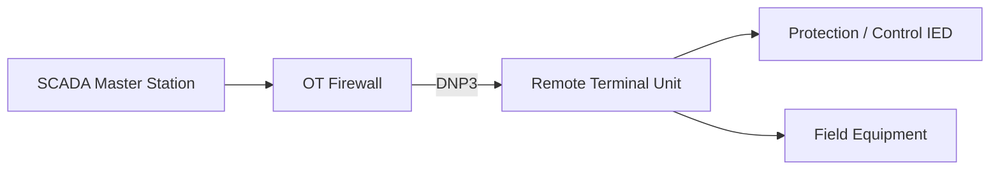

# DNP3 Protocol Security — Electrical Grid Cybersecurity

## 1. Project Objective

Study the cybersecurity risks and protective controls associated with Distributed Network Protocol 3 (DNP3) in electrical grid automation and SCADA environments.

This document covers protocol architecture, potential threats, security controls, and proposed laboratory validation.

## 2. What Is DNP3?

DNP3 is an industrial communication protocol commonly used in electric utilities, water infrastructure, and remote monitoring systems.

In electrical grid environments, DNP3 supports communication between SCADA master stations and remote devices such as RTUs and intelligent electronic devices (IEDs).

### Typical Architecture



This diagram represents a simplified conceptual deployment.

## 3. DNP3 Communication

DNP3 supports operations such as:

- Reading analog measurements
- Reading binary status information
- Receiving event notifications
- Issuing authorized control commands
- Monitoring remote equipment

DNP3 commonly uses TCP or UDP port 20000 in IP-based deployments, although actual configurations can vary.

## 4. DNP3 Cybersecurity Threats

| Threat ID | Threat Scenario | Potential Impact |
|---|---|---|
| DNP-T01 | Unauthorized control commands | Unintended equipment operation |
| DNP-T02 | Manipulated measurement values | Incorrect operator decisions |
| DNP-T03 | Replay of captured messages | Misleading system state or unexpected operations |
| DNP-T04 | Unauthorized access to RTUs | Compromise of remote monitoring or control |
| DNP-T05 | Network denial-of-service | Loss or delay of SCADA communication |
| DNP-T06 | Compromised SCADA master | Unauthorized remote operations |

These scenarios represent potential risks, not attacks demonstrated in this project.

## 5. DNP3 Secure Authentication

DNP3 Secure Authentication provides mechanisms designed to authenticate selected critical operations.

Important considerations:

- Authentication helps verify the origin of supported operations.
- It does not automatically encrypt all DNP3 traffic.
- Deployment support depends on device capabilities and protocol versions.
- Network-level protections may still be necessary.

Security should not rely solely on protocol authentication.

## 6. Recommended Security Controls

### Network Segmentation

- Restrict DNP3 communication to approved SCADA masters and remote devices.
- Apply least-privilege firewall rules.
- Prevent unrestricted enterprise-to-OT access.
- Monitor communication across security boundaries.

### Device Security

- Harden RTUs and engineering workstations.
- Restrict configuration interfaces.
- Protect authentication credentials.
- Maintain approved device configurations.

### Monitoring and Detection

- Baseline normal DNP3 traffic.
- Monitor unexpected control requests.
- Investigate connections from unauthorized sources.
- Identify unusual communication rates.
- Review security logs where available.

## 7. Proposed Firewall Policy

| Source | Destination | Service | Intended Action |
|---|---|---|---|
| Authorized SCADA Master | Approved RTU | DNP3 TCP 20000 | ALLOW |
| Authorized RTU | Approved SCADA Master | Required return traffic | ALLOW |
| Enterprise Network | RTU Network | Direct DNP3 access | DENY |
| Unknown Hosts | OT Devices | Unapproved DNP3 traffic | DENY |

These are illustrative requirements. Production rules must account for actual communication direction, connection initiation, approved endpoints, and operational requirements.

## 8. Planned Hands-On Validation

Future work will include:

1. Deploy a simulated DNP3 master and outstation.
2. Establish legitimate DNP3 communication.
3. Capture traffic using Wireshark.
4. Identify protocol functions and communication endpoints.
5. Test authorized and unauthorized network access paths.
6. Examine available monitoring and detection capabilities.
7. Record findings with screenshots and packet-capture evidence.

All testing will be performed in an authorized simulation.

## 9. Wireshark Analysis

A useful Wireshark display filter for DNP3 traffic is:

```text
dnp3
```

For the commonly used TCP port:

```text
tcp.port == 20000
```

These filters can help identify DNP3 communication during future packet-capture analysis.

## 10. Relevant Security Standards

- IEEE 1815 — DNP3
- IEC 62351 — Power system communication security
- IEC 62443 — Industrial automation cybersecurity
- NIST SP 800-82 — Operational technology security

These standards are referenced for security design and learning purposes. No formal compliance assessment has been performed.

## 11. Project Status

**Completed:**
- DNP3 protocol research
- Threat scenario identification
- Proposed firewall controls
- Planned security validation activities

**Pending:**
- DNP3 simulation deployment
- Packet capture and analysis
- Firewall testing
- Security monitoring validation

## 12. Conclusion

DNP3 security requires a combination of authenticated operations where supported, restricted network communication, hardened remote devices, and effective monitoring.

This document establishes a foundation for future hands-on DNP3 security testing in a simulated electrical grid environment.
