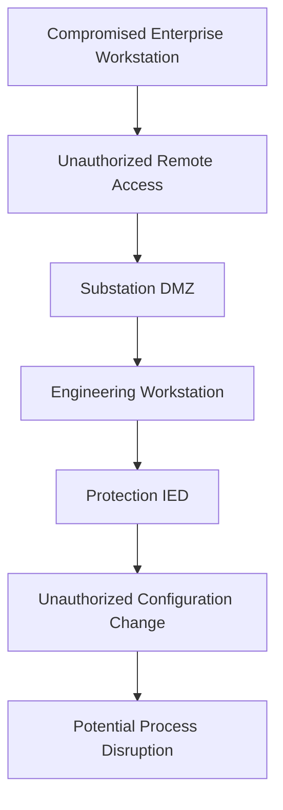

# Electrical Substation Cybersecurity — Threat Model

## 1. Objective

Develop a conceptual cybersecurity threat model for a digital electrical substation, identifying critical assets, trust boundaries, potential attack paths, security impacts, and recommended mitigations.

This assessment applies IEC 62443 zone-and-conduit principles and considers threats affecting IEC 61850 and DNP3 communications.

## 2. System Scope

The proposed environment contains:

- SCADA server and HMI
- Engineering workstation
- Substation gateway
- Protection relays and intelligent electronic devices (IEDs)
- Remote terminal units (RTUs)
- Station and process networks
- Substation DMZ and security gateways
- Industrial communication protocols

This is an architectural threat model, not an assessment of a deployed substation.

## 3. Critical Assets

| Asset | Security Priority |
|---|---|
| Protection relays and IEDs | Integrity, availability, safety |
| SCADA and HMI | Integrity, availability |
| Engineering workstation | Integrity, controlled access |
| Substation gateway | Availability, communication integrity |
| RTUs | Integrity, availability |
| Industrial network infrastructure | Availability, segmentation |
| Configuration backups | Integrity, recoverability |

## 4. Trust Boundaries

Important trust boundaries include:

1. Enterprise network to Substation DMZ
2. Substation DMZ to Station network
3. Station network to Bay network
4. Engineering workstation to protection IEDs
5. SCADA master to remote DNP3 outstations

Crossing these boundaries should require an explicitly authorized communication path.

## 5. Conceptual Attack Paths

The diagram illustrates a hypothetical attack chain. No such compromise has been performed or observed in this project.

## 6. Threat Register

| ID | Threat Scenario | Potential Impact | Priority |
|---|---|---|---|
| TM-01 | Compromised engineering workstation | Unauthorized IED configuration changes | High |
| TM-02 | Unauthorized IEC 61850 MMS control | Unintended switching or control operation | High |
| TM-03 | Spoofed IEC 61850 GOOSE traffic | Incorrect protection response | High |
| TM-04 | Unauthorized DNP3 control commands | Unintended remote equipment operation | High |
| TM-05 | Excessive cross-zone access | Increased lateral movement opportunities | High |
| TM-06 | Compromised substation gateway | Loss of supervisory communication integrity | High |
| TM-07 | Denial-of-service on protection networks | Communication delays or availability loss | High |
| TM-08 | Manipulated measurement data | Incorrect operator or automation decisions | High |
| TM-09 | Unauthorized remote engineering access | Compromise of critical device configurations | High |
| TM-10 | Inadequate security monitoring | Delayed detection of suspicious activity | Medium |

Priorities are preliminary judgments based on potential consequences, not calculated risk scores.

## 7. Detailed Threat Analysis

### TM-01 — Engineering Workstation Compromise

**Scenario:** An attacker gains access to an engineering workstation and attempts to change protection relay settings.

**Potential consequences:**
- Unauthorized configuration modifications
- Protection-system malfunction
- Loss of configuration integrity

**Recommended mitigations:**
- Strong authentication and least privilege
- Restricted engineering access
- Application allowlisting where appropriate
- Configuration backups and change approval
- Monitoring of engineering activities

### TM-02 — Unauthorized IEC 61850 MMS Control

**Scenario:** An unauthorized system attempts supervisory control operations against an IED.

**Recommended mitigations:**
- Restrict MMS endpoints and permitted operations
- Apply supported access controls
- Use appropriate secure communication mechanisms
- Monitor unexpected control activity

### TM-03 — Spoofed GOOSE Messages

**Scenario:** An unauthorized device attempts to introduce forged protection-related messages onto a relevant Ethernet segment.

**Recommended mitigations:**
- Physical and logical network isolation
- Switch port security
- Appropriate IEC 62351 security mechanisms where supported
- Monitoring for unexpected publishers and abnormal message patterns

Security controls must preserve protection timing requirements.

### TM-04 — Unauthorized DNP3 Commands

**Scenario:** An attacker attempts to issue unauthorized commands to a remote outstation.

**Recommended mitigations:**
- Restrict communication to approved SCADA masters
- Use DNP3 Secure Authentication where supported
- Apply firewall rules and device access controls
- Monitor critical control operations

### TM-05 — Inadequate Network Segmentation

**Scenario:** Excessive network permissions permit unauthorized movement from lower-trust systems toward critical OT devices.

**Recommended mitigations:**
- Define security zones and conduits
- Apply least-privilege firewall policies
- Restrict remote access through approved gateways
- Validate permitted and blocked communication paths

### TM-07 — Protection Network Denial-of-Service

**Scenario:** Excessive or malformed traffic affects communication availability.

**Recommended mitigations:**
- Protect critical network segments
- Monitor traffic rates
- Design for operational resilience
- Test security changes without disrupting protection functions

## 8. Security Requirements

| Requirement ID | Proposed Security Requirement |
|---|---|
| SR-01 | Restrict access to engineering workstations |
| SR-02 | Limit SCADA-to-IED communication to approved paths |
| SR-03 | Protect IED configuration integrity |
| SR-04 | Segment enterprise and substation networks |
| SR-05 | Monitor unauthorized industrial control activity |
| SR-06 | Protect remote access and administrative credentials |
| SR-07 | Maintain configuration backups and recovery procedures |
| SR-08 | Preserve protection-system availability and timing |

## 9. Planned Validation

Future authorized laboratory work may include:

1. Build a simulated substation environment.
2. Identify assets and network trust boundaries.
3. Generate normal IEC 61850 or DNP3 traffic.
4. Test approved communication paths.
5. Test blocked access across security zones.
6. Investigate protocol activity using packet captures.
7. Evaluate monitoring coverage.
8. Document findings and revise the threat model.

## 10. Framework Alignment

This threat model references concepts from:

- IEC 62443 — Zones, conduits, risk-based security
- IEC 62351 — Power system communication security
- NIST SP 800-82 — OT security guidance
- MITRE ATT&CK for ICS — Industrial threat behaviors

These references do not establish formal standards compliance.

## 11. Current Status

**Completed:** Conceptual asset identification, trust-boundary analysis, threat scenarios, and proposed mitigations.

**Pending:** Laboratory implementation, attack-path validation, security-control testing, and evidence collection.

## 12. Conclusion

Electrical
